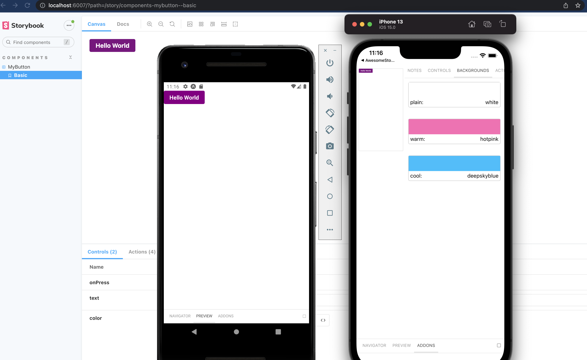
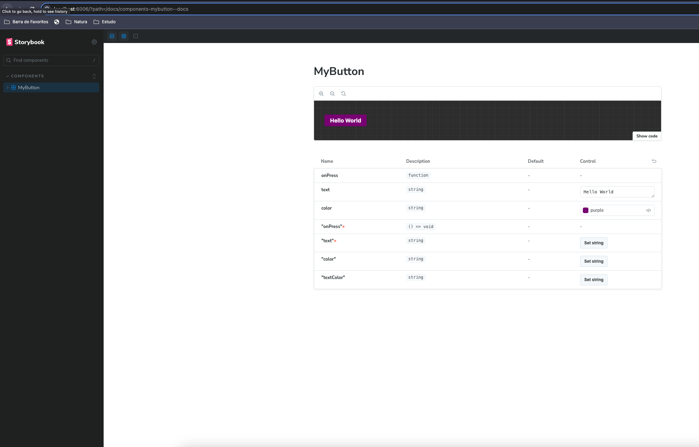

A starter project with react native 0.73.x, @storybook/react-native 8.0 beta, storybook/addon-react-native-web




# getting started

To get all the dependencies run

```
yarn install
```

To run on the web use

```
yarn storybook
```

To run on ios or android

```
yarn start
```

in another terminal run

```
yarn ios
```

or

```
yarn android
```

If you add new stories on the native (ondevice version) you either need to have the watcher running or run the stories loader

To update the stories one time

```
yarn update-stories
```

## By: Douglas Morais
